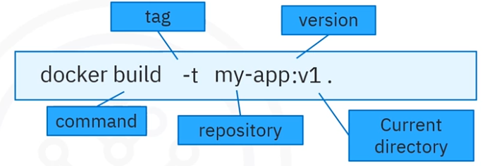
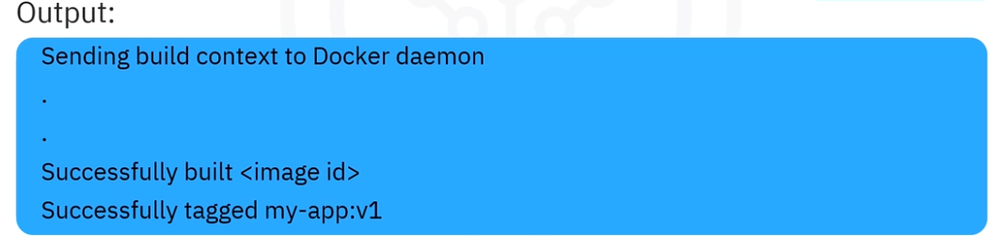
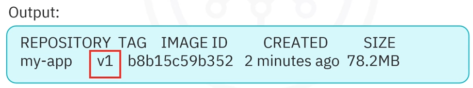

# Building and Running  Container Images

Welcome to building and running containers. After watching this video, you will be able 

- build a container image using a Dockerfile. 
- Create a running container using an image and 
- describe key Docker commands. 

This diagram shows the development process of a running container. The steps to create and run containers: 

- create a dockerfile 
- use the dockerfile to create a container image and 
- use the container image to create a running container. 

Use a Dockerfile to create a running container. 

```dockerfile
FROM alpine CMD ["echo", "Hello World!"]
```

This sample docker file has the commands `FROM` and `CMD`. `From` defines the base image and `CMD` prints the words *hello world* on the terminal. 



You'll notice that this Docker command uses the **build command**, **the tag**, **the repository**, **the version**, and **the current directory**. 



After you run this build, the output messages include sending build context to Docker Daemon, successfully built image, which confirms image creation and successfully tagged my-app, which confirms the tag. 



To verify the creation of the image, run the 

```dockerfile
docker images
```

command. The output displays the repository, my-app, as well as the tag, v1, image ID, creation date, and the image size. 

## Docker run command

```dockerfile
docker run my-app:v1
```

Create the container using the run command with the container image name and tag, the application prints the words *hello world*. 

Execute the 

```dockerfile
docker ps -a
```

command, which displays the details of the container created. 

## Docker commands

| Docker command | Purpose                                     | Example                       |
| -------------- | ------------------------------------------- | ----------------------------- |
| build          | create container images from a Dockerfile   | `docker build -t my-app:v1`   |
| images         | List all images, repositories and size      | `docker images`               |
| run            | Create a container from an image            | `docker run -p 8080:80 nginx` |
| push           | Store images in a configured registry       | `docker push my-app:v1`       |
| pull           | Retrieves images from a configured registry | `docker pull nginx`           |

Given the appropriate input. The build command is used to create container images with tags from a docker file. The images command will list all the images, their repositories and tags, and their sizes. The run command creates and runs a container from an image. The push command stores images in a configured registry, and the pull command retrieves images from a configured registry. 

## Recap

In this video, you learned that 

- the build command is used with a *Dockerfile* to build a container image. 
- The run command is used with an image to create a running container and 
- key *Dockerfile* commands include build, images, run, pull, and push.